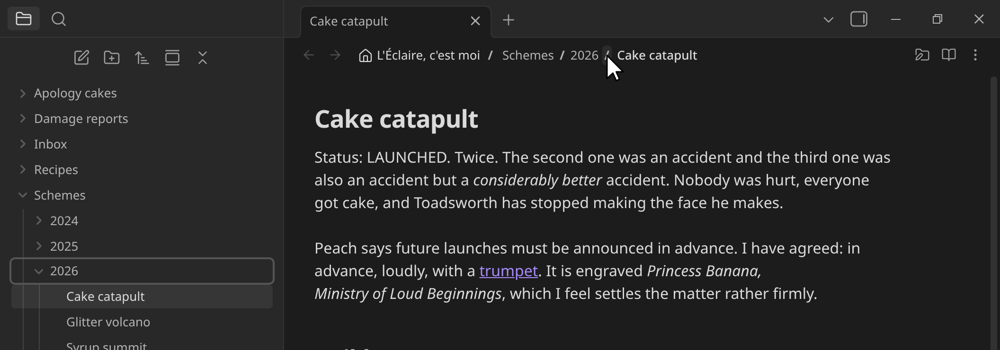
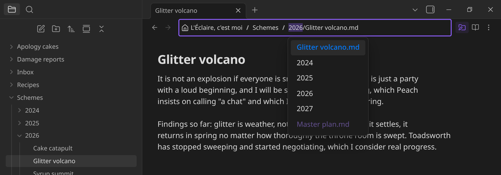

<!-- Tłumaczenie README.md — stan: commit 7b2691a.
     Tłumaczenie maszynowe (Claude Opus 5), nieskorygowane przez native
     speakerów. Poprawki mile widziane; wersją rozstrzygającą jest
     angielskie README. -->

**Przeczytaj to w innych językach:** [English](../../README.md) · [العربية](README.ar.md) · [አማርኛ](README.am.md) · [Беларуская](README.be.md) · [বাংলা](README.bn.md) · [Català](README.ca.md) · [Čeština](README.cs.md) · [Dansk](README.da.md) · [Deutsch](README.de.md) · [Ελληνικά](README.el.md) · [Español](README.es.md) · [فارسی](README.fa.md) · [Suomi](README.fi.md) · [Français](README.fr.md) · [Gaeilge](README.ga.md) · [עברית](README.he.md) · [Magyar](README.hu.md) · [Bahasa Indonesia](README.id.md) · [Italiano](README.it.md) · [日本語](README.ja.md) · [ქართული](README.ka.md) · [ភាសាខ្មែរ](README.kh.md) · [한국어](README.ko.md) · [Latviešu](README.lv.md) · [Bahasa Melayu](README.ms.md) · [नेपाली](README.ne.md) · [Nederlands](README.nl.md) · [Norsk](README.no.md) · **Polski** · [Português](README.pt.md) · [Português (Brasil)](README.pt-BR.md) · [Română](README.ro.md) · [Русский](README.ru.md) · [संस्कृतम्](README.sa.md) · [Slovenčina](README.sk.md) · [Shqip](README.sq.md) · [Српски](README.sr.md) · [Svenska](README.sv.md) · [ไทย](README.th.md) · [Türkçe](README.tr.md) · [Українська](README.uk.md) · [Oʻzbekcha](README.uz.md) · [Tiếng Việt](README.vi.md) · [简体中文](README.zh.md) · [繁體中文](README.zh-TW.md)

# Lure

Wtyczka do [Obsidiana](https://obsidian.md), która zamienia nazwę pliku na pasku nagłówka notatki w klikalną, edytowalną ścieżkę przez cały skarbiec — jak pasek adresu w menedżerze plików [Dolphin](https://apps.kde.org/dolphin/).

Obsidian 1.4.0+ · tylko komputer · AGPL-3.0

## Ujawnienie użycia SI

- **Agent** — **Claude Opus 5** i **Claude Sonnet 5** (Anthropic, przez Claude Code): napisał TypeScript, CSS, wszystkie 45 zestawów tłumaczeń i dokumentację. Tłumaczenia powstały maszynowo i nie były sprawdzane przez native speakerów.
- **Autor** — Vault51: określił każdą funkcję, przetestował każdą wersję w prawdziwym skarbcu, pokierował poprawkami, przejrzał wszystkie wyniki.
- **Zużycie** — 3–13 sierpnia 2026, dziewięć sesji, ~4928 odpowiedzi: ~7,2 mln wygenerowanych tokenów, ~23,7 mln wysłanych, ~1169,6 mln odczytów z pamięci podręcznej (~1200,5 mln łącznie).

## Funkcje

- **Kliknięcie folderu** otwiera listę z zawartością folderu *nadrzędnego* — zamień jeden folder na sąsiedni, nie ruszając reszty ścieżki. Nazwa notatki działa tak samo, razem z rozszerzeniem.
- **Kliknięcie separatora** za folderem pokazuje go i rozwija w Przeglądarce plików. Jedno ustawienie zamienia obie role.
- **Prawy przycisk myszy lub przeciągnięcie dowolnej pozycji** — menu kontekstowe i przeciąganie samej Przeglądarki plików.
- **Kliknięcie nazwy pliku lub pustego miejsca** pozwala wpisać ścieżkę, z uzupełnianiem. `/` schodzi w dół, <kbd>Backspace</kbd> wychodzi poziom wyżej, <kbd>Enter</kbd> zatwierdza.
- **Przycisk ołówka na folderze** przełącza te same interakcje na przenoszenie/zmianę nazwy, ze sprawdzeniami takimi, jakie robi sam Obsidian.
- **Przytrzymaj <kbd>Ctrl</kbd>**, aby otworzyć w nowej karcie — albo, w trybie przenoszenia/zmiany nazwy, aby skopiować tam notatkę zamiast ją przenosić.
- **<kbd>F2</kbd>** przełącza między tytułem w treści a paskiem ścieżki.
- **Kliknięcie nazwy skarbca** pozwala przeglądać inne skarbce, katalog domowy, katalog główny systemu plików i zamontowane napędy bez zmiany skarbca. Tylko do odczytu, dopóki nie otworzysz kłódki, i przez cały czas obramowane kolorem błędu. Domyślnie wyłączone — zobacz [poza skarbcem](#poza-skarbcem).
- **Dwa poziomy ostrzeżenia** — czerwony poza skarbcem, pomarańczowy dla plików tekstowych, dla których Obsidian nie ma edytora. Zobacz [dwa kolory ostrzeżeń](usage.pl.md#dwa-kolory-ostrzeżeń).
- **Ikony podatne na motywy**, wymienne z poziomu fragmentu CSS — i **45 języków**, wszystkie, które dostarcza Obsidian.
- **Ustawienia:** wyrównanie, gotowe separatory, które kliknięcie otwiera listę, nazwa skarbca, pliki ukryte.

*W trybie przenoszenia/zmiany nazwy ta sama lista oferuje co innego: na górze przypięta bieżąca nazwa notatki, aby przenieść ją bez zmiany nazwy; poniżej foldery, do których można ją przenieść; a nazwy już zajęte wyszarzone, żeby nic nie zostało przypadkiem nadpisane.*

→ [Pełny przewodnik](usage.pl.md)

## Poza skarbcem

Zasady Obsidiana dla twórców wymagają, by wtyczka wyjaśniła każdy dostęp do plików poza skarbcem, więc bez owijania w bawełnę:

**Czy w ogóle cokolwiek z tego robi.** Tylko jeśli włączysz **Dostęp do plików zewnętrznych**, który jest **domyślnie wyłączony**. Przy wyłączonej opcji nie ma z wtyczki żadnej drogi do ścieżki zewnętrznej, a nic z opisanego niżej kodu nigdy się nie wykonuje.

**Co czyta.** Tylko wtedy, gdy o to poprosisz. Kliknięcie nazwy skarbca wypisuje twoje pozostałe skarbce — odczytane z własnego pliku `obsidian.json` Obsidiana — a do tego katalog domowy, katalog główny systemu plików i zamontowane napędy (`/proc/mounts` na Linuksie, `/Volumes` na macOS, litery dysków na Windowsie). Przeglądanie stamtąd wypisuje zawartość katalogów, a otwarcie pliku czyta ten jeden plik.

**Co zapisuje.** Nic, dopóki nie naciśniesz przycisku, który to mówi. Takie przyciski są dwa i każdy obejmuje wyłącznie własny zakres:

- Przycisk **Edytuj jako tekst** w podglądzie odblokowuje plik, który masz przed sobą — ten jeden plik w tej jednej karcie. Od tej chwili twoje zmiany są w nim zapisywane w miarę pisania.
- **Kłódka** w nagłówku, widoczna tylko wtedy, gdy pasek ścieżki wskazuje poza skarbiec, odblokowuje tworzenie, zmianę nazwy i przenoszenie w ścieżkach zewnętrznych. Zamyka się z powrotem, gdy wrócisz do środka, więc zgoda nigdy nie przeżywa folderu, dla którego jej udzielono.

Żadne z odblokowań nie jest zapisywane w obszarze roboczym ani w ustawieniach, więc zapis nigdy nie jest odbezpieczony na pliku, o którego otwarciu nie pamiętasz. W żadnym z tych stanów nic nie jest nadpisywane — istniejący cel jest odrzucany, przy użyciu wyłącznego tworzenia oferowanego przez sam system plików, a nie sprawdzenia, które mogłoby przegrać wyścig — a notatki nigdy nie da się *przenieść* poza skarbiec, bo odnośniki do niej pękłyby po cichu; przytrzymanie <kbd>Ctrl</kbd> kopiuje ją tam zamiast tego.

**Po co.** Notatki, których szukasz, często leżą w innym skarbcu, w folderze synchronizacji albo na pendrivie, a własna odpowiedź Obsidiana — zmień skarbiec — zamyka wszystko, co miałeś otwarte. To pozwala pójść i zajrzeć bez wychodzenia, a przy okazji poprawić literówkę.

**Ograniczenie.** Edytor Obsidiana jest przywiązany do plików wewnątrz skarbca, więc pliku zewnętrznego **nie da się** otworzyć jako prawdziwej notatki, z odnośnikami, odnośnikami zwrotnymi i całą resztą; nie potrafi tego żadna wtyczka. Lure pokazuje go zamiast tego we własnym podglądzie (Markdown, obrazy, dźwięk, wideo, PDF), a dla wszystkiego innego oferuje *Otwórz zewnętrznie*. Pasek ścieżki pozostaje obramowany kolorem błędu, kiedy tylko wskazuje poza skarbiec, a trop zaczyna się w miejscu, które wybrałeś — nazwie skarbca, katalogu domowym, napędzie — a nie w układzie katalogów maszyny.

## Instalacja

Jeszcze nie ma jej w katalogu wtyczek społeczności.

**Ręcznie:** pobierz `main.js`, `manifest.json` i `styles.css` z [najnowszego wydania](https://github.com/Gelaende51/obsidian-lure/releases) do `<vault>/.obsidian/plugins/lure/`, a potem włącz wtyczkę w **Ustawienia → Wtyczki społeczności**.

**BRAT:** dodaj `Gelaende51/obsidian-lure` jako wtyczkę beta.

**Ze źródeł:** `npm install && npm run build` — zobacz [rozwój](../development.md).

## Zgodność

Żadna wtyczka nie jest wymagana. Wbudowana **Przeglądarka plików**, jeśli jest włączona, jest tym, co pokazuje foldery na pasku bocznym; bez niej te kliknięcia nic nie robią.

Sprawdzone z wtyczkami społeczności, które dzielą nagłówek notatki albo odpowiadają na kliknięcie folderu — w obu kolejnościach ładowania, każda włączona i wyłączona:

- [Folder notes](obsidian://show-plugin?id=folder-notes) — separator otwiera notatkę folderu zamiast go pokazywać, dzięki czemu każdy odcinek ścieżki staje się miejscem, do którego można pójść. To jedyna wtyczka notatek folderowych, która zajmuje ścieżkę w nagłówku; [Folder Note](obsidian://show-plugin?id=folder-note-plugin) i [create folder notes with dropdown](obsidian://show-plugin?id=create-folder-notes-with-dropdown) tam nie nasłuchują, więc separator pokazuje folder jak zwykle.
- [Quick Explorer](obsidian://show-plugin?id=quick-explorer) i [Front Matter Title](obsidian://show-plugin?id=obsidian-front-matter-title-plugin) — obie rysują w tym samym elemencie nagłówka; Lure zachowuje swój wiersz niezależnie od kolejności ładowania, a wyłączenie którejkolwiek zostawia drugą nienaruszoną.
- [Nav Link Header](obsidian://show-plugin?id=nav-link-header), [Running Head](obsidian://show-plugin?id=running-head), [Crumbs](obsidian://show-plugin?id=crumbs-obsidian), [Breadcrumbs](obsidian://show-plugin?id=breadcrumbs) — mają własny pasek i współistnieją bez problemu.

Tylko komputer — model interakcji potrzebuje najeżdżania kursorem, precyzyjnych kliknięć i klawiatury. Pełne wyniki, to, co pozostaje do sprawdzenia, i porównanie z Quick Explorer oraz Breadcrumbs znajdują się w [zgodności](../compatibility.md).

## Współtworzenie

- Zgłoszenia i pull requesty mile widziane — zwłaszcza **poprawki tłumaczeń**, bo wszystkie 45 języków przetłumaczono maszynowo i nie sprawdzali ich native speakerzy. Konfigurację i zasady opisuje [rozwój](../development.md).
- **Zgłaszanie błędów:** https://github.com/Gelaende51/obsidian-lure/issues
- **Darowizny:** [Ko-fi](https://ko-fi.com/vault51). Wtyczka i tak jest darmowa i na licencji AGPL; napiwki cieszą, ale nigdy nie są wymagane. Zamiarem jest kompensacja śladu węglowego — zamiarem, nie zobowiązaniem: nic nie zostanie skompensowane, dopóki suma nie będzie warta zachodu, a ten wiersz powie o tym, gdy naprawdę coś zostanie skompensowane.

## Podziękowania

- **Vault51** — autor: projekt, wymagania i testy ręczne przez cały czas.
- **Claude Opus 5** i **Claude Sonnet 5** (Anthropic, przez Claude Code) — implementacja, tłumaczenia i dokumentacja, pod kierunkiem autora. Zobacz [ujawnienie użycia SI](#ujawnienie-użycia-si).
- **[Obsidian](https://obsidian.md)** — aplikacja, którą to rozszerza, i źródło każdego komponentu używanego przez wtyczkę: jej API wtyczek, zestaw ikon Lucide stojący za `setIcon`, dołączona instancja i18next, z której czytane są etykiety menu kontekstowego, oraz jej własne klasy i zmienne CSS. Nic obcego nie jest dołączane; wtyczka **nie ma zależności w czasie działania**.

> **Zespół Obsidiana nie brał w tym projekcie żadnego udziału** — nie napisał go, nie sprawdził, nie poparł ani nie wspiera. Obsidian jest znakiem towarowym Dynalist Inc.; to niezależna, niepowiązana wtyczka.

Współtwórcy będą wymieniani tutaj w miarę napływu wkładu.

## Odnośniki

- **Dokumentacja:** [docs/](../)
- **Obecność w sieci / źródła:** https://github.com/Gelaende51/obsidian-lure
- **Darowizny:** [Ko-fi](https://ko-fi.com/vault51) — zobacz [współtworzenie](#współtworzenie).
- **Licencja:** [LICENSE](../../LICENSE) — GNU AGPL-3.0-only, © 2026 Vault51. Forki i redystrybuowane wydania muszą udostępniać swoje źródła na tej samej licencji.
